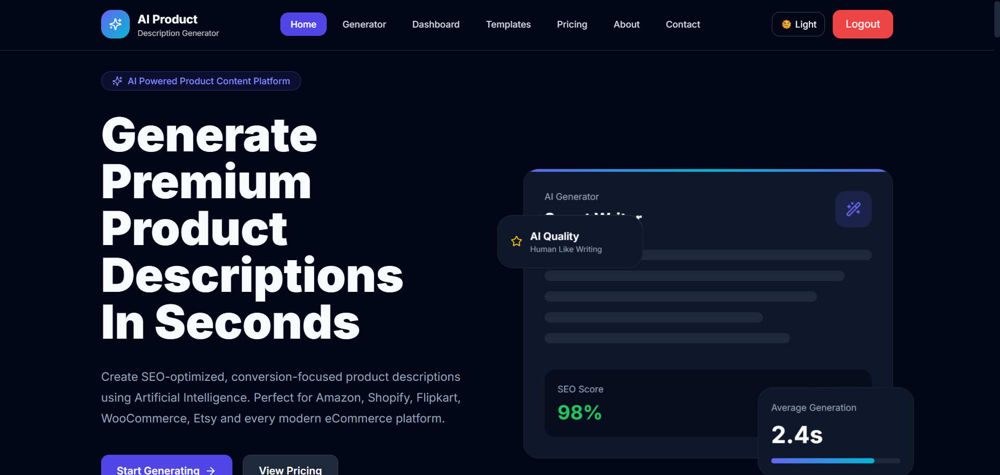
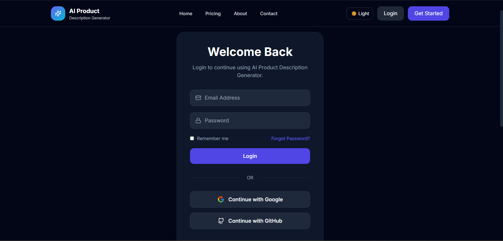
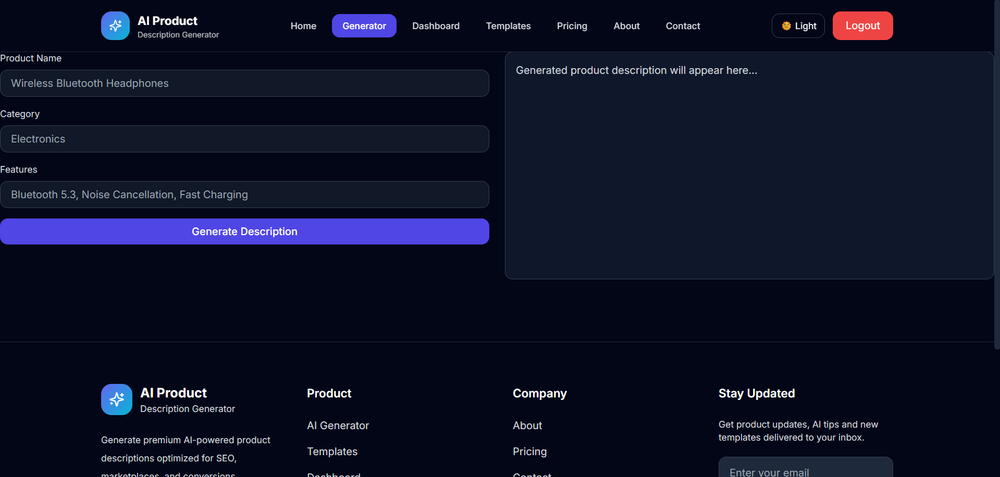
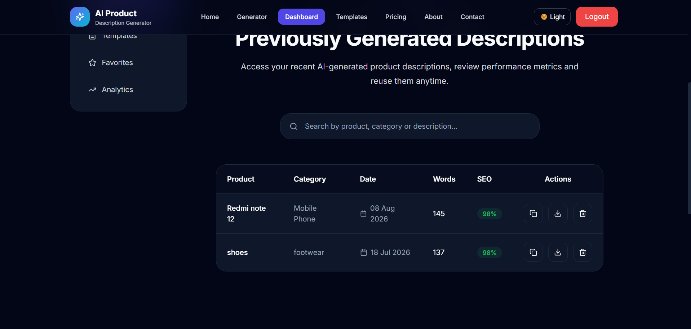

# 🚀 AI Product Description Generator

A modern AI-powered web application that generates professional product descriptions using a clean and responsive interface. The project follows a full-stack architecture with a React frontend, Express backend, MongoDB Atlas database, and secure user authentication using JWT and Google OAuth.

---

# 🌐 Live Demo

### Frontend

[https://ai-product-description-generator-green.vercel.app](https://ai-product-description-generator-green.vercel.app)

### Backend API

[https://ai-product-description-generator-tebb.onrender.com](https://ai-product-description-generator-tebb.onrender.com)

---

# 📸 Screenshots

### Home Page



### Login Page



### AI Product Description Generator



### Product History



---

# ✨ Features

- 🤖 AI Product Description Generation
- 📝 Generate high-quality product descriptions
- 📂 Product History Management
- 🔍 Search Products
- ✏️ Update Product Details
- 🗑️ Delete Products
- 💾 Persistent MongoDB Atlas Storage
- 🔐 User Authentication (JWT)
- 🌐 Google OAuth Login
- 🛡️ Protected Routes & APIs
- 🔑 Password Hashing with bcrypt
- ✅ Input Validation
- 🚦 Rate Limiting
- 📱 Fully Responsive UI
- 🌙 Dark Theme Interface
- ⚡ RESTful API Architecture
- 🔔 Toast Notifications

---

# 🛠️ Tech Stack

## Frontend

- React (Vite)
- Tailwind CSS
- Framer Motion
- Axios
- React Hot Toast
- React Hook Form
- React Router DOM
- Lucide React

## Backend

- Node.js
- Express.js
- Passport.js
- JWT (jsonwebtoken)
- bcryptjs
- express-validator
- express-rate-limit

## Database

- MongoDB Atlas
- Mongoose ODM

## Authentication

- JWT Authentication
- Google OAuth 2.0
- Passport Google OAuth Strategy

## Version Control & Deployment

- Git
- GitHub
- Vercel
- Render

---

# ⚙️ Setup Instructions

## 1. Clone Repository

```bash
git clone https://github.com/darick-kartik/ai-product-description-generator.git
cd ai-product-description-generator
```

---

## 2. Backend Setup

Navigate to the backend folder:

```bash
cd backend
```

Install dependencies:

```bash
npm install
```

Create a `.env` file inside the `backend` folder.

```env
PORT=5000

MONGO_URI=your_mongodb_connection_string

JWT_SECRET=your_jwt_secret

GOOGLE_CLIENT_ID=your_google_client_id

GOOGLE_CLIENT_SECRET=your_google_client_secret

GOOGLE_CALLBACK_URL=http://localhost:5000/api/auth/google/callback

FRONTEND_URL=http://localhost:5173
```

Start the backend server:

```bash
npm run dev
```

The backend will run at:

```text
http://localhost:5000
```

---

## 3. Frontend Setup

Open a new terminal and navigate to the frontend folder:

```bash
cd frontend
```

Install dependencies:

```bash
npm install
```

Create the required frontend environment variable:

```env
VITE_API_URL=http://localhost:5000/api
```

Start the frontend:

```bash
npm run dev
```

The frontend will run at:

```text
http://localhost:5173
```

---

## 4. Environment Configuration

A sample environment configuration is available in:

```text
backend/.env.example
```

Do not commit actual credentials, database connection strings, OAuth secrets, or JWT secrets to GitHub.

---

# 📡 API Documentation

## Authentication APIs

| Method | Endpoint | Description |
| ------ | -------- | ----------- |
| POST | `/api/auth/register` | Register User |
| POST | `/api/auth/login` | Login User |
| GET | `/api/auth/google` | Google OAuth Login |

---

### Register User

```http
POST /api/auth/register
```

Example Request:

```json
{
  "name": "Kartik",
  "email": "kartik@example.com",
  "password": "yourpassword"
}
```

---

### Login User

```http
POST /api/auth/login
```

Example Request:

```json
{
  "email": "kartik@example.com",
  "password": "yourpassword"
}
```

---

### Google OAuth Login

```http
GET /api/auth/google
```

This endpoint redirects the user to Google authentication.

---

# 📦 Product APIs

| Method | Endpoint | Description |
| ------ | -------- | ----------- |
| GET | `/api/products` | Get All Products |
| GET | `/api/products/:id` | Get Product by ID |
| GET | `/api/products/search?q=` | Search Products |
| POST | `/api/products` | Create Product *(Protected)* |
| PUT | `/api/products/:id` | Update Product *(Protected)* |
| DELETE | `/api/products/:id` | Delete Product *(Protected)* |

---

### Get All Products

```http
GET /api/products
```

Example Response:

```json
{
  "success": true,
  "count": 2,
  "data": []
}
```

---

### Get Product by ID

```http
GET /api/products/:id
```

---

### Search Products

```http
GET /api/products/search?q=phone
```

---

### Create Product

```http
POST /api/products
```

**Authentication:** Required

Example Request:

```json
{
  "name": "Wireless Headphones",
  "category": "Electronics",
  "features": "Noise cancellation, Bluetooth, long battery life"
}
```

---

### Update Product

```http
PUT /api/products/:id
```

**Authentication:** Required

Example Request:

```json
{
  "name": "Updated Product Name"
}
```

---

### Delete Product

```http
DELETE /api/products/:id
```

**Authentication:** Required

---

# 🏗️ Architecture / Project Structure

The project follows a full-stack client-server architecture.

```text
AI-Product-Description-Generator
│
├── frontend
│   ├── src
│   ├── public
│   └── package.json
│
├── backend
│   ├── config
│   ├── controllers
│   ├── middleware
│   ├── models
│   ├── routes
│   ├── server.js
│   ├── .env.example
│   └── package.json
│
├── docs
│   └── screenshots
│       ├── home.png
│       ├── login.png
│       ├── generator.png
│       └── history.png
│
└── README.md
```

### Application Flow

```text
User
  │
  ▼
React Frontend
  │
  │ HTTP Requests
  ▼
Express.js Backend
  │
  ├── Authentication
  ├── Validation
  ├── Product APIs
  └── AI Feature
  │
  ▼
MongoDB Atlas
```

The React frontend communicates with the Express.js backend through REST APIs. Authentication is handled using JWT and Google OAuth, while MongoDB Atlas provides persistent data storage.

---

# 🗄️ Database

This project uses **MongoDB Atlas** as the primary database.

## Why MongoDB?

- Flexible document-based schema
- Easy integration with Node.js
- Cloud-hosted database
- Scalable architecture
- Suitable for storing product information and generated descriptions

---

## 📊 Database Schema

The application stores product information in the **Product** collection.

### Schema Diagram

<!-- Add your database schema diagram here if available -->

---

# 🔐 Authentication & Security

The application implements secure authentication and security mechanisms using:

- JWT Authentication
- Google OAuth 2.0 Login
- Password Hashing with bcrypt
- Protected Backend APIs
- Protected Frontend Routes
- Input Validation using express-validator
- Rate Limiting using express-rate-limit
- CORS Configuration
- Environment Variables for Sensitive Credentials

---

# ⚠️ Known Limitations

- The application depends on external cloud services such as MongoDB Atlas, Vercel, and Render.
- Free-tier hosting services may have limited resources or cold-start delays.
- Google OAuth requires correctly configured OAuth credentials and callback URLs.
- AI functionality depends on the configured AI service and its availability.
- Advanced analytics and user profile management are not currently implemented.

---

# 🔮 Future Improvements

- 📄 Export Product Descriptions to PDF
- ⭐ Favorite Products
- 📊 Dashboard Analytics
- 📧 Email Verification
- 🔑 Password Reset
- 👤 User Profile Management
- 🏷️ Product Categories
- 📈 Advanced Product Analytics

---

# 🙏 Credits & Acknowledgements

Developed as part of the **AI-Assisted Full Stack Web Development Internship**.

The project was developed using modern full-stack technologies including React, Node.js, Express.js, MongoDB Atlas, Tailwind CSS, Passport.js, Git, and GitHub.

AI-assisted development tools were used during the development process for:

- Debugging
- Code assistance
- Understanding implementation approaches
- Documentation assistance
- Development guidance

---

# 👨‍💻 Author

**Kartik Chauhan**

**Intern ID:** TBI-26101240

**Graphic Era University**