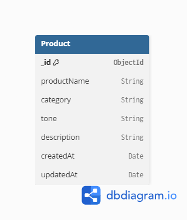

# 🚀 AI Product Description Generator

A modern AI-powered web application that generates professional product descriptions using a clean and responsive interface. The project follows a full-stack architecture with a React frontend, Express backend, MongoDB Atlas database, and secure user authentication using JWT and Google OAuth.

---

# ✨ Features

- 🤖 AI Product Description Generation
- 📝 Generate high-quality product descriptions
- 📂 Product History Management
- 🔍 Search Products
- ✏️ Update Product Details
- 🗑️ Delete Products
- 💾 Persistent MongoDB Atlas Storage
- 🔐 User Authentication (JWT)
- 🌐 Google OAuth Login
- 🛡️ Protected Routes & APIs
- ✅ Input Validation
- 🚦 Rate Limiting
- 📱 Fully Responsive UI
- 🌙 Dark Theme Interface
- ⚡ RESTful API Architecture

---

# 🛠️ Tech Stack

## Frontend

- React (Vite)
- Tailwind CSS
- Framer Motion
- Axios
- React Hot Toast
- React Hook Form
- React Router DOM
- Lucide React

## Backend

- Node.js
- Express.js
- Passport.js
- JWT (jsonwebtoken)
- bcryptjs
- express-validator
- express-rate-limit

## Database

- MongoDB Atlas
- Mongoose ODM

## Authentication

- JWT Authentication
- Google OAuth 2.0
- Passport Google OAuth Strategy

## Version Control

- Git
- GitHub

---

# 📂 Project Structure

```text
AI-Product-Description-Generator
│
├── frontend
│   ├── src
│   ├── public
│   └── package.json
│
├── backend
│   ├── config
│   ├── controllers
│   ├── middleware
│   ├── models
│   ├── routes
│   ├── server.js
│   ├── .env.example
│   └── package.json
│
└── README.md
```

---

# 🗄️ Database Choice

This project uses **MongoDB Atlas** as the primary database.

### Why MongoDB?

- Flexible document-based schema
- Easy integration with Node.js
- Cloud-hosted free tier
- Scalable architecture
- Ideal for storing generated product descriptions and user accounts

---

## 📊 Database Schema

The application stores product information in a **Product** collection.

### Schema Diagram



---

# 🔐 Authentication & Security

The application implements secure authentication using:

- JWT Authentication
- Google OAuth 2.0 Login
- Password Hashing with bcrypt
- Protected Backend APIs
- Protected Frontend Routes
- Input Validation using express-validator
- Rate Limiting using express-rate-limit
- CORS Configuration

---

# ⚙️ Environment Variables

Create a `.env` file inside the backend folder.

```env
PORT=5000

MONGO_URI=your_mongodb_connection_string

JWT_SECRET=your_jwt_secret

GOOGLE_CLIENT_ID=your_google_client_id

GOOGLE_CLIENT_SECRET=your_google_client_secret

GOOGLE_CALLBACK_URL=http://localhost:5000/api/auth/google/callback

FRONTEND_URL=http://localhost:5173
```

A sample configuration is available in:

```text
backend/.env.example
```

---

# 🚀 Installation

## Clone Repository

```bash
git clone https://github.com/darick-kartik/ai-product-description-generator.git
```

## Backend

```bash
cd backend
npm install
npm run dev
```

## Frontend

```bash
cd frontend
npm install
npm run dev
```

---

# 📡 API Endpoints

## Authentication APIs

| Method | Endpoint | Description |
|---------|----------|-------------|
| POST | /api/auth/register | Register User |
| POST | /api/auth/login | Login User |
| GET | /api/auth/google | Google OAuth Login |

---

## Product APIs

| Method | Endpoint | Description |
|---------|----------|-------------|
| GET | /api/products | Get All Products |
| GET | /api/products/:id | Get Product by ID |
| GET | /api/products/search?q= | Search Products |
| POST | /api/products | Create Product *(Protected)* |
| PUT | /api/products/:id | Update Product *(Protected)* |
| DELETE | /api/products/:id | Delete Product *(Protected)* |

---

# 🌐 Live Demo

### Frontend
https://ai-product-description-generator-green.vercel.app

### Backend API
https://ai-product-description-generator-tebb.onrender.com

# 🔮 Future Improvements

- AI API Integration
- Product Categories
- Export to PDF
- Favorites
- Dashboard Analytics
- Email Verification
- Password Reset
- User Profile Management

---

# 👨‍💻 Author

**Kartik Chauhan**

**Intern ID:** TBI-26101240

Graphic Era University

---

# ⭐ Acknowledgement

Developed as part of the **AI-Assisted Full Stack Web Development Internship**.